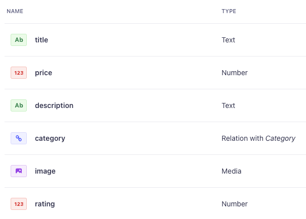
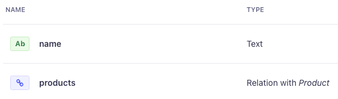

# Strapstro

Let us join the forces of Strapi and Astro to create a new version of the Fake Store.

## Project organization

Create a new folder called 'strapstro' for this project and initialize a new git repository.
Inside the project folder create two new folders: `client` and `server`.

```bash
strapstro
    ├── client
    └── server
```

## Server - Strapi

Make sure you are in the server directory and create a new project there.

```bash
cd server
npx create-strapi-app@latest .
```

Create the content types, necessary to similate the Fakestore API.
It should be something like the following screenshots.
Turn the draft/publish switch off. It would be rather annoying at this time.

### Product



### Category



### Importing data

You don't have to copy-paste the data yourself. There a little script provided that will do it for you. Have a look at he `productimporter` project. This is a nodeJS script that will fetch the products from the fakestore API and import them into our Strapi project, also with the REST api.

It is important to set the permissions for the product and category content types to `find` and `findone` and `create` for the public role.
Also check `upload` under the `Upload` section.

If everything went well, you should be able to see the products and categories in the admin panel + you REST API should be working.

## Client - Astro

You can start with our previous Astro fakestore. Copy the whole project into the `client` folder. The package.json file should be in the root of the `client` folder.

### 2 processes

You have to keep two processes running. One for the server and one for the client. This means you have to open two terminals.

### Strapi url

Last time, we hardcoded the url of the fakestore API. This is rather messy, look at us now: we have to go through all our code to see where we need to change it.
And imagine if we would deploy this to a production server. Then we would have to change this on every build, terrible!
So this time we will use a `.env` file to store the url of the Strapi server. We will create a variable there which contains the url. It is simply a matter of using that variable in our code.
When we would run our project in a different _environment_, we only have to update that .env file.

Create a `.env` file in the root of the `client` folder and add the following line:

```bash
STRAPI_URL=http://localhost:1337
```

DO NOT COMMIT THIS FILE TO GIT! It can contain sensitive information like authnentication keys and passwords.

### Astro and Strapi

Although using data from Strapi in Astro is a case of doing a fetch. Astro provides us with a nice little wrapper to make some things less repetitive.

Have a look at the [guide](https://docs.astro.build/en/guides/cms/strapi/) but take notice of the following:

- The wrapper is written in TypeScript. (There is a plain JS version provided with these instructions)
- We won't be creating interfaces for our content types
- We are not interested in "Server-side rendering" at this time.
- You can skip the "Publishing" part also

### Implementation

Try to show the products on the home page by using the wrapper. You will have to tweak properties since Strapi structures its content differently than the fakestore API.

Some tips and tricks:

- See how a result from the Strapi API is returned, it's all about the `data` and `attributes` properties.
- We simplyfied the rating propery, it is just a number now.
- You can use the [Optional chaining](https://developer.mozilla.org/en-US/docs/Web/JavaScript/Reference/Operators/Optional_chaining) operator to have less error-prone code.
- You will have to populate some extra data with your API requests
- You can make use of conditional rendering when certain properties are not present (when you didn't populate them)
- Since our images are stored on the Strapi server, they have a different url than the fakestore API. You will have to authorize `localhost` to get full advantage of the Image component.

## Category pages

Extend our project with category pages. It is kind of the same approach as with the tag pages from the blog tutorial. Get the categories from the Strapi API in a getStaticPaths function. Try to show the page with a matching title first.

### ProductsList refactoring

Since we have to show all the products in a certain category, we could make use of the ProductsList component. There is an issue though: at the moment, we fetch all the products inside the ProductsList component. That is convienient for the home page, but not for the category pages. What if we could pass in a list of products to the ProductsList component? That's exectly what props are for!

- Refactor the ProductsList component so that it can accept a list of products as a prop.
- Refactor the home page so that it fetches all the products and sends it to the ProductsList component.
- In a category page, fetch the products for that category and send it to the ProductsList component.
- Be aware that you will have to populate all the **necessary** data for the products.

## Client side filtering

We can show products from a certain category on a category page. These pages are generated at build time. But let us create something more interactive, even faster. We will create a client side filter.

### Filter component

Create a new component called `Filter`. It should be a list with labels and checkboxes. Hide the checkboxes and make sure users are able to (de)select checkboxes by clicking on the labels. The labels should contain the category names.

To decide if a product should be shown or not, we will use a [data attribute](https://developer.mozilla.org/en-US/docs/Learn/HTML/Howto/Use_data_attributes) on the `<li>` element wrapped around the article. So go ahead and make sure that the category name is set as a data attribute like: `data-category="categoryname"`

Create a CSS class `hidden` in the global stylesheet. We will be hiding elements instead of removing them from the DOM, otherwise they are gone for further filter operations.

### Filter logic

- When any option changes: hide all products, select the ones that match the selected categories and show them.
- When no options are selected: show all products.

Time to dig up your good ol' `querySelectorAll` and `classList` skills and make this happen. The [attribute selector](https://developer.mozilla.org/en-US/docs/Web/CSS/Attribute_selectors) will come in handy.

### Not there yet

At first, the filter will work. But when you navigate to another page and then back to the home page, the filter will not work anymore. This is because those fancy page tranisitions we've implemented the last time. See the [docs](https://docs.astro.build/en/tutorials/add-view-transitions/#update-scripts) for a solution.

## Further improvements

### Slug

Instead of using the ID for the products and the categories, it would be better to use a [slug](https://strapi.io/blog/how-to-create-a-slug-system-in-strapi-v4) Be aware though that those aren't automatically generated if you genereate data via the API.

### QS

The Astro wrapper for Strapi is ok to start, but it can become a bit cumbersome when you have to do more complex queries. A long querystring is hard to maintain.

A way to improve this is using [the qs library](https://github.com/ljharb/qs) as mentioned in the [documentation](https://docs.strapi.io/dev-docs/api/rest/sort-pagination)

Your fetchApi function could then look something like this:

```javascript
import qs from "qs";

export default async function fetchApi({
  endpoint,
  params = undefined,
  wrappedByKey = undefined,
  wrappedByList = undefined,
}) {
  
  if (endpoint.startsWith("/")) {
    endpoint = endpoint.slice(1);
  }

  const url = new URL(
    `${import.meta.env.STRAPI_URL}/api/${endpoint}${
      params ? `?${qs.stringify(params, { encodeValuesOnly: true })}` : ``
    }`
  );

...
```
